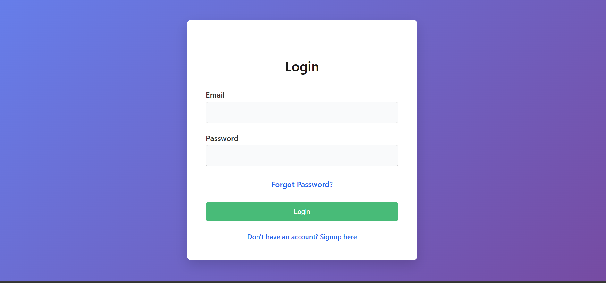
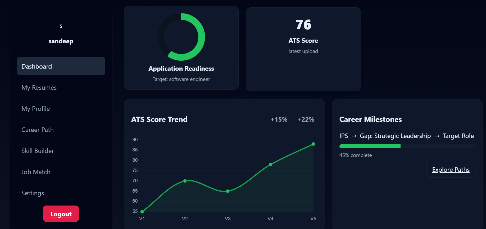
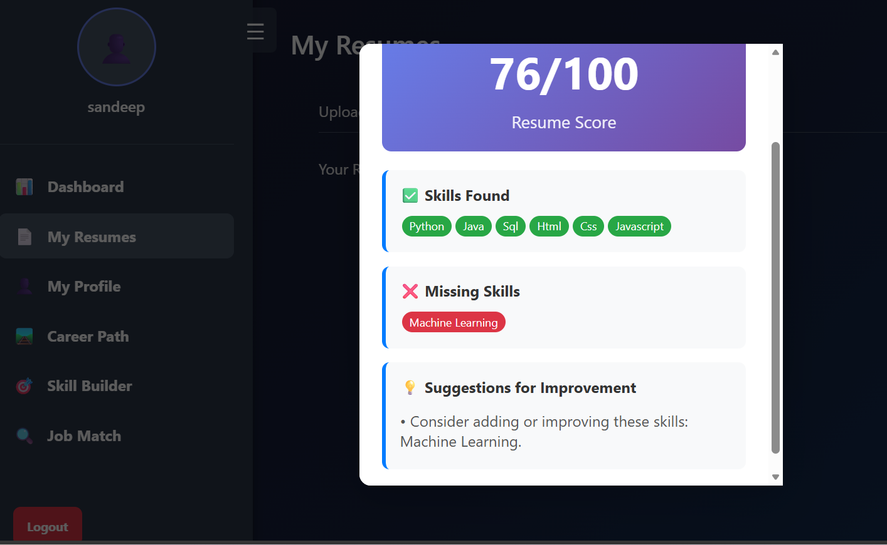
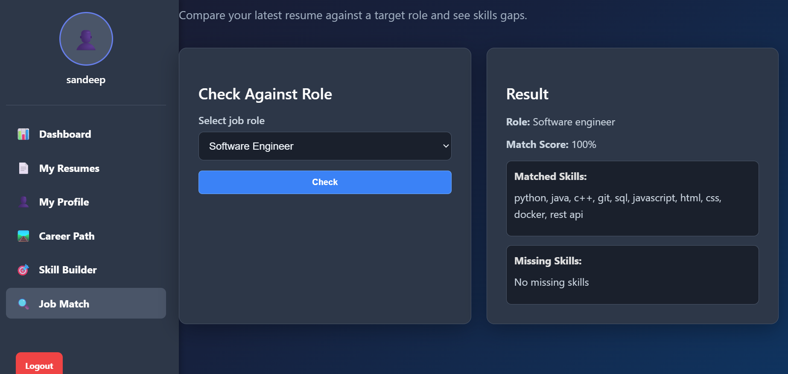
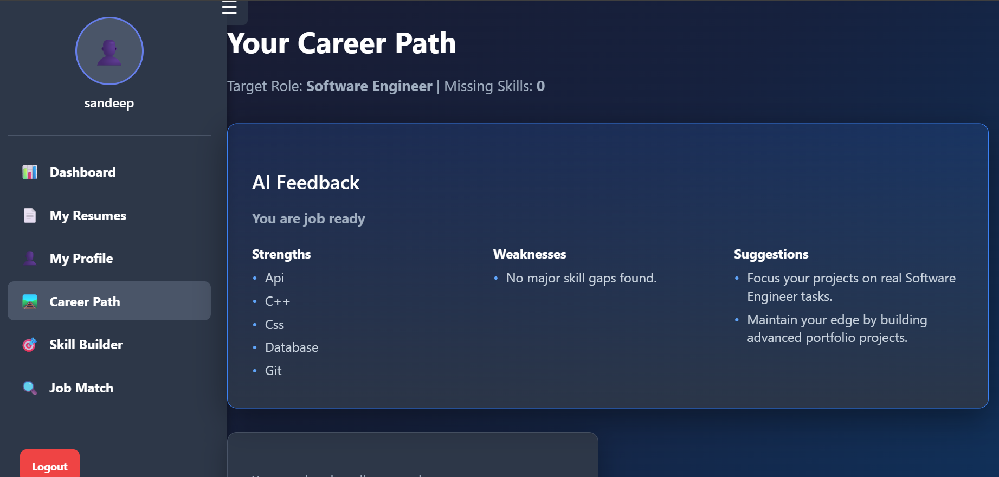
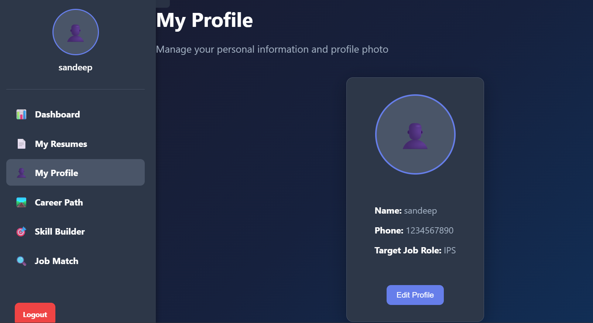

# RACGS

 ## Resume Analyzer and Career Guidance System

 RACGS is a Flask web application for reviewing resumes, extracting skills, comparing resumes with predefined career roles, and turning skill gaps into learning plans. It combines PDF/DOCX document processing, rule-based resume analysis, account management, and career-planning workflows in a single browser-based application.

 **Live demo:** [resume-analyzer-and-career-guidance.onrender.com](https://resume-analyzer-and-career-guidance.onrender.com)

 ## Project Overview

 The active web application is implemented in `app.py`. Users create an account, complete a profile, upload resumes, review extracted content and analysis, compare skills with available roles, and build a learning roadmap from missing skills. Data is stored in a local SQLite database and uploaded resume files are stored in the local `uploads/` directory.

 The application’s web analysis is deterministic and rule-based. It does not call an AI service or an external job-listings API.

 ## Implemented Features

 - Account registration, login, logout, and session-based access control
 - Password storage with Werkzeug password hashing
 - Profile setup and profile editing for name, phone number, target role, and profile image
 - Password reset using Gmail SMTP, time-limited OTP verification, and reset tokens
 - PDF and DOCX resume uploads with extension and size validation
 - Resume text extraction with PyPDF2 and python-docx
 - Stored resume list, resume detail view, and deletion of user-owned resumes
 - Rule-based resume analysis covering sections, word count, measurable achievements, keywords, and important skills
 - Skill extraction using the local skills database
 - ATS-oriented scoring across skills, projects, experience, education, and formatting
 - Resume-to-role matching against roles defined in `data/job_roles.json`
 - Job-description matching through the job-match workflow
 - Career roadmap generation based on missing skills
 - Daily and weekly planning from roadmap items
 - Skill detail and skill-building views
 - Dashboard summaries for resumes, ATS score, missing skills, target role, and development information
 - Interview question generation and heuristic answer evaluation in the reusable `core` modules
 - Career readiness, job-search, and salary-trajectory calculations in the reusable `core` modules
 - Recruiter-style first-impression scoring, concerns, and recommendations in the reusable `core` modules

 The reusable modules in `core/` provide broader analysis capabilities. The Flask routes primarily use the simpler, route-level workflow in `app.py`; the `RACSSystem` orchestration layer in `main.py` is separate from the active web route flow.

 ## Screenshots
 ### Login


### Dashboard


### Resume Analysis


### Job Matching


### Career Guidance


### Profile


 ## Technology Stack

 ### Backend

 - Python
 - Flask `2.3.3`
 - Flask-SQLAlchemy `3.0.5`
 - Werkzeug `2.3.7`
 - itsdangerous, SMTP, SQLite, JSON, and Python standard-library modules
 - python-dotenv `1.0.0` for local `.env` loading

 ### Document Processing

 - PyPDF2 `3.0.1`
 - python-docx `1.0.0`

 ### Frontend

 - HTML templates in Jinja2
 - CSS
 - Browser JavaScript
 - Chart.js is loaded by the dashboard frontend from a CDN

 ### Data and Supporting Libraries

 The pinned requirements also include NumPy `1.26.4`, pandas `2.1.1`, scikit-learn `1.3.1`, NLTK `3.8.1`, and TextBlob `0.17.1`. They are available in the environment, but the active Flask and `core` implementation does not directly use them.

 ## How It Works

 1. A visitor registers or logs in through the Flask application.
 2. The user completes or updates their profile and selects a target role.
 3. A PDF or DOCX resume is uploaded. The server validates the extension and size, extracts text, and stores the resume record and extracted text in SQLite.
 4. Resume analysis identifies relevant sections, keywords, skills, formatting signals, and missing skills using local rules and JSON data.
 5. The dashboard and resume pages present the stored resume information, ATS-oriented score, and analysis results.
 6. The job-match workflow compares resume or job-description skills with predefined role requirements.
 7. Career-path, planner, and skill-builder pages turn missing skills into roadmap and learning tasks.

 ## Project Structure

 ```text
 Racgs/
 ├── app.py                         # Active Flask web application
 ├── main.py                        # Reusable RACSSystem orchestration layer
 ├── requirements.txt               # Pinned Python dependencies
 ├── .env.example                   # Environment variable template
 ├── core/
 │   ├── ats_scorer.py
 │   ├── career_simulator.py
 │   ├── interview_generator.py
 │   ├── job_matcher.py
 │   ├── recruiter_view.py
 │   ├── resume_improver.py
 │   ├── resume_processor.py
 │   ├── roadmap_generator.py
 │   ├── skill_extractor.py
 │   └── skill_gap_analyzer.py
 ├── data/
 │   ├── job_roles.json              # Predefined career roles and requirements
 │   └── skills_database.json        # Skill matching data
 ├── roadmap_data.json               # Roadmap data used by planning features
 ├── templates/                      # Flask/Jinja2 pages
 │   ├── career_path.html
 │   ├── dashboard.html
 │   ├── dashboard_modern.html       # Alternate template present in the repository
 │   ├── forgot_password.html
 │   ├── job_match.html
 │   ├── login.html
 │   ├── my_resumes.html
 │   ├── planner.html
 │   ├── profile.html
 │   ├── register.html
 │   ├── reset_password.html
 │   ├── resume_detail.html
 │   ├── setup_profile.html
 │   ├── signup.html
 │   ├── skill_builder.html
 │   └── verify_otp.html
 └── static/
        ├── dashboard_modern.js
        ├── profile.jpg
        ├── script.js
        ├── style.css
        └── style_dashboard.css
 ```

 Runtime-generated files such as `app.db`, `uploads/`, and profile-upload directories may appear locally. They are excluded by `.gitignore` and are not part of the source structure above.

 ## Local Setup

 ### Prerequisites

 - Python 3.12 or a compatible supported Python version
 - Git

 ### Installation

 ```powershell
 git clone https://github.com/Sai-Dharla/Racgs.git
 cd Racgs
 python -m venv .venv
 .venv\Scripts\Activate.ps1
 python -m pip install -r requirements.txt
 ```

 If PowerShell activation is unavailable, run the virtual-environment interpreter directly:

 ```powershell
 .venv\Scripts\python.exe -m pip install -r requirements.txt
 ```

 ### Configure the Environment

 Create a local file named `.env` in the project root:

 ```dotenv
 SECRET_KEY=replace-with-a-long-random-development-secret
 GMAIL_SMTP_USER=
 GMAIL_SMTP_PASS=
 ```

 Generate a secret with:

 ```powershell
 python -c "import secrets; print(secrets.token_hex(32))"
 ```

 `SECRET_KEY` is required. The Gmail variables are optional and are only needed for email-based password-reset OTP delivery.

 ### Run

 ```powershell
 python app.py
 ```

 Open [http://127.0.0.1:5000/](http://127.0.0.1:5000/) in a browser. The application loads `.env` at startup through python-dotenv. Never commit `.env`; use `.env.example` as the placeholder template.

 ## Environment Variables

 | Variable | Required | Purpose |
 | --- | --- | --- |
 | `SECRET_KEY` | Yes | Signs Flask sessions and application tokens. |
 | `GMAIL_SMTP_USER` | No | Gmail account used to send password-reset OTP email. |
 | `GMAIL_SMTP_PASS` | No | Gmail app password used by the SMTP connection. |

 The application uses SQLite at `app.db` beside `app.py`. It does not currently read a `DATABASE_URL` variable. Resume uploads use the local `uploads/` directory.

 ## Security Considerations

 Implemented protections include:

 - Environment-based secret and SMTP configuration
 - Password hashing with Werkzeug
 - Session checks on authenticated workflows
 - Ownership checks before viewing or deleting a resume
 - `secure_filename` and generated names for resume uploads
 - Resume extension and request-size checks
 - Separate profile-image extension and size checks
 - One-hour password-reset token expiration
 - Ten-minute OTP expiration and removal after successful verification
 - `.env`, database files, uploads, backups, and virtual environments excluded in `.gitignore`

 Before production use, review the remaining hardening needs: CSRF protection, MIME/content validation for uploads, OTP rate limiting and cryptographically secure OTP generation, secure session-cookie settings, production error handling, disabled Flask debug mode, and non-public storage for profile images and uploaded documents.

 ## Render Deployment

 The live demo is hosted at [resume-analyzer-and-career-guidance.onrender.com](https://resume-analyzer-and-career-guidance.onrender.com). A Render web service can use the following commands:

 **Build command**

 ```text
 pip install -r requirements.txt && pip install gunicorn
 ```

 **Start command**

 ```text
 gunicorn app:app
 ```

 Configure `SECRET_KEY` in Render’s environment settings. Add `GMAIL_SMTP_USER` and `GMAIL_SMTP_PASS` only when password-reset email delivery is required. The repository has no Render YAML, Dockerfile, or Procfile. SQLite and local uploads are suitable for a demo but are not durable storage for a production deployment, and the current application does not use Render’s `PORT` variable explicitly.

 ## Screenshots

 No screenshot files are currently stored in the repository. Add current screenshots here when available, for example:

 ```text
 screenshots/
 ├── login.png
 ├── dashboard.png
 ├── resume-analysis.png
 └── job-matching.png
 ```

 ## Future Improvements

 - Add automated tests and continuous integration
 - Add CSRF protection, rate limiting, secure cookie configuration, and production logging
 - Validate upload MIME types and file contents
 - Move production data from local SQLite and filesystem storage to managed database and object storage services
 - Make deployment port configuration and production serving settings explicit
 - Improve the rule-based analysis with more robust NLP or an optional AI integration
 - Add persistent progress tracking for roadmap and planner tasks
 - Add external job data integration and richer role recommendations
 - Add an accessible screenshot gallery and user-facing documentation

 ## Author

 Saibabu Dharla